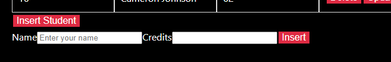
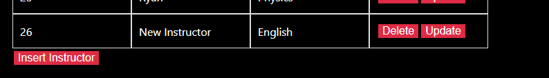
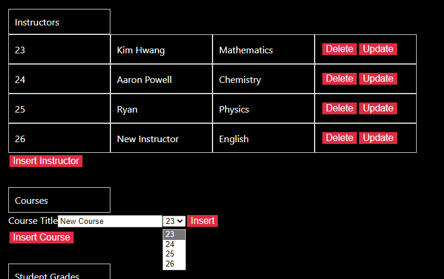
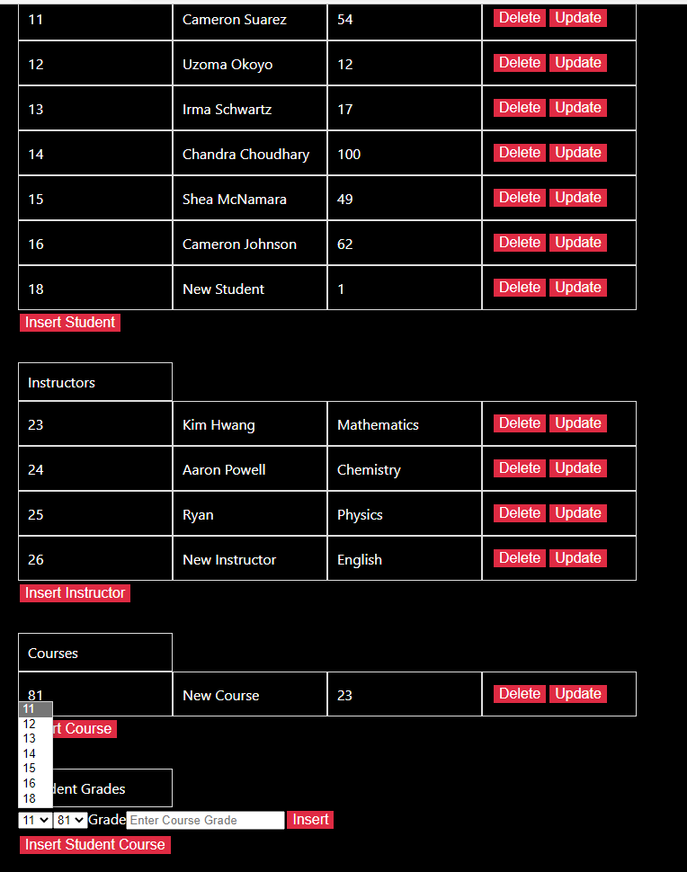
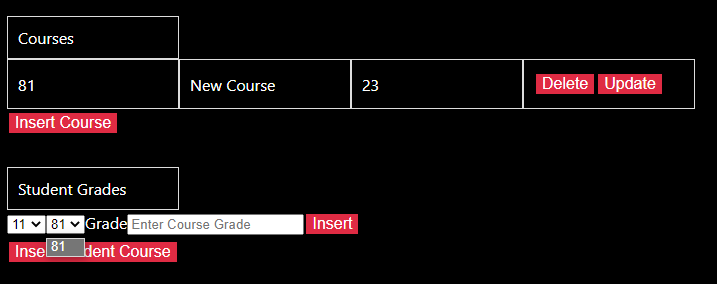
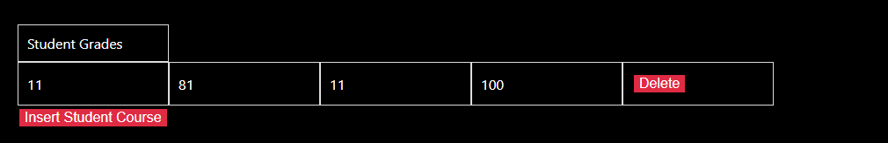
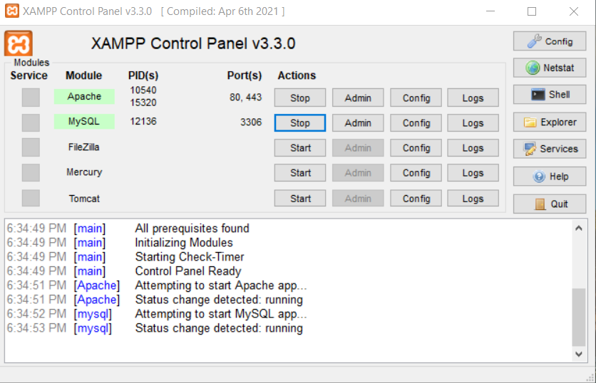
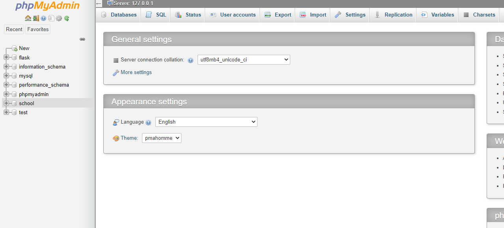

# CMSC_447_Assignment1 Overview

This is the overview of the project, there are four tables on display and it includes the table for the student, instructor, course, and the student_course table, and for each table, the user can insert a new object, they can delete an existing object and they also have the ability to update an object in each table.
## How the application Works:
* A student table contains the name, number or credits and id of that particular student.
* A new Student can be inserted by clicking the insert button under the student table, then user is prompted with a form to fill out the student information

* After the user fills out the form and inserts the student, the new student will be inserted into the table and also displayed by the table.

* An Insrtuctor table contains the name, course department and id of that particular instructor.
* A new instructor can be inserted by clicking the insert button under the instructor table, then user is prompted with a form to fill out the instructor information

* After the user fills out the form and inserts the instructor, the new instructor will be inserted into the table and also displayed by the table.

* A course contains the the id of the course, the title of the course, and the Instructor of the course
* There is one to many relationship between the course and Instructor so in the context of this application that means that in order for a course to be inserted into the there needs to be a instructor that can teach that course
* Therefore in the application the user can only insert a course from the list of instructors that are available, and here is how it looks

* As seen by the image the user is only able to insert an instructor from the list of instructors table and cannot just insert and random instructor.
* Here is the final result

* The last table in the application is the Student/Course Table, and this table is a many-to-many table between the student and the course
* For this application when a course inserted it prompts the user to insert the course id and student id and the grade of the student 
* The course id and student id already exists and the user is required to select from that list

* As seen above only the list of the Students that already exist are apart of the options

* As seen above only the list of the courses that already exist are apart of the options

* Once the student and course are inserted here is the result:

## How to run the project(Step 1: Set Up Database)

 Start By downloading Xampp link: https://www.apachefriends.org/download.html
 
 Once Xampp is downloaded click start for APache and MYsql on the Xampp Application
 
 
 
 Then to run the Database on web browser go to this link:  http://localhost/phpmyadmin/
 
 Then Click on School database in order to access the tables of the database:
 
 
 
 ## How to run the project(Step 2: Flask Installation)

* Download Python(Include Pip): 
* Install Flask with command: pip install Flask
*  Install Marshmallow with command: pip install flask-marshmallow
*  Install Flask CORS with command: pip install -U flask-cors
*  Install SQLAlchemy with command: pip install Flask-SQLAlchemy
*  Install mysqlclient with command: pip install mysqlcleint

## How to run the project(Step 3: React Installation with Node)
* Install node js : https://nodejs.org/en/download/
* Install react : https://www.liquidweb.com/kb/install-react-js-windows/#:~:text=1%20To%20get%20started%2C%20we%20need%20to%20open,project%20and%20update%20the%20package.json%20file%20with%20dependencies.

## 
